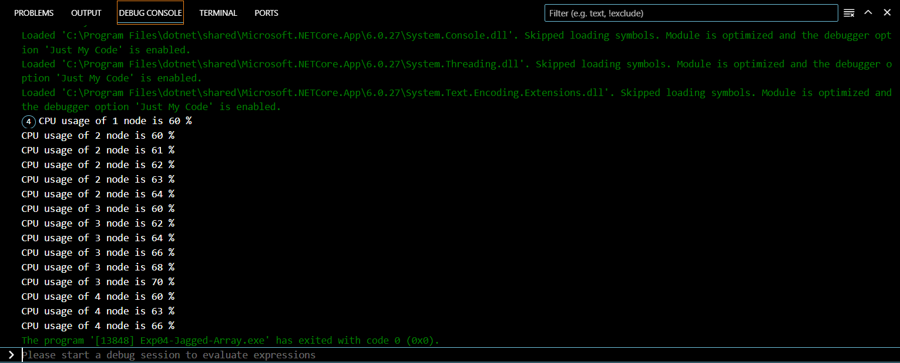

# Exp04-Jagged-Array
## Aim:
To write a C# program to create a sample CPU usage on a network with 4 nodes using a jagged array.
## Algorithm:
### Step1:
Import Necessary Libraries.
### Step2:
 The code starts by declaring a class named Pattern. In C#, all executable code must be contained within a class.
### Step3:
Inside the Pattern class, there's a static method named Main. 
### Step4:
The calculated CPU usage for each node is printed to the console using the Console.WriteLine.
### Step5:
End the program.
## Program:
```c#
using System;

public class Pattern
{
    public static void Main()
    {
        int[][] jaggedArray = new int[4][];
        jaggedArray[0] = new int[4];
        jaggedArray[1] = new int[5];
        jaggedArray[2] = new int[6];
        jaggedArray[3] = new int[3];

        for (int i = 0; i < jaggedArray.Length; i++)
        {
            int usage = 0; 
            for (int j = 0; j < jaggedArray[i].Length; j++)
            {
                usage = i * j + 60; //Calcuting the CPU usage
                Console.WriteLine("CPU usage of {0} node is {1} %", i + 1, usage);
            }
        }
    }
}

```
## Output:


## Result
Thus,To write a C# program to create a sample CPU usage on a network with 4 nodes using a jagged array executed successfully.